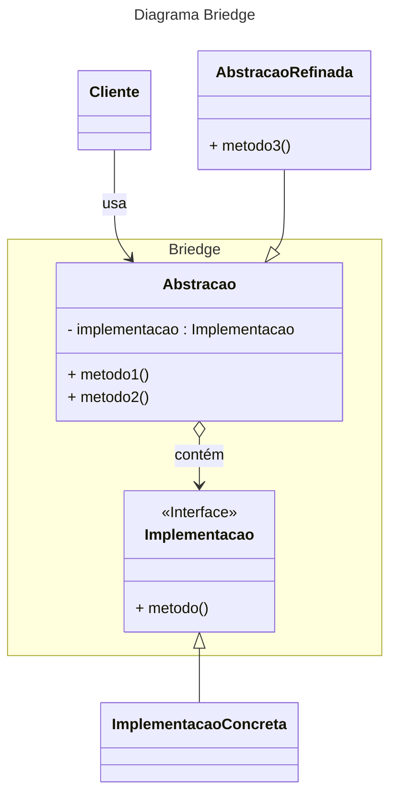

# Bridge

O `Bridge (Ponte)` é um design pattern estrutural que permite dividir uma classe grande em um conjunto de classes ligada entre si e separadas em duas hierarquias: abstração e implementação. Essas hierarquias podem ser trabalhadas de forma independente.  
A **abstração é um contrato**, estabelecendo uma regra que deve ser seguida por todas as implementações baseadas nela.  
Já a **implementação é a aplicação de uma lógica** própria desenvolvida em cima das regras estabelecidas pela abstração.  
De forma geral, é um pattern muito útil para organizar uma classe monolítica em partes menores que possam escalar em várias dimensões. Ele também possibilita a troca da implementação no momento da execução.  
Todavia, aplicar esse padrão em uma classe muito coesa pode tornar o código muito complicado.  

## Problema prático

Considere a existência de uma classe Forma, cuja suas duas filhas são `Círculo` e `Quadrado`. Deseja-se criar duas sub-variações de suas filhas baseadas em cores, `Vermelho` e `Azul`.  
Realizar essa tarefa utilizando herança fará o código aumentar de tamanho exponencialmente, já que para cada nova forma seria necessário criar uma nova implementação para cada cor, o mesmo vale para cada nova cor.  

## Solução do Problema

Tendo em vista o problema apresentado, herança não é uma boa solução, já que o código está sendo estendido em mais de uma dimensão.  
Nesse contexto o `Bridge` substitui a herança pela composição, extraindo uma das dimensões para uma classe separada que será parte da primeira. Assim, a `Cor` seria uma parte da `Forma`, não herdando todas as suas características.  
`Cor` então se torna uma interface que aceita infinitas implementações, tais como `Vermelho`, `Azul`, `Roxo`, etc. Sendo facilmente extensível, já que `Forma` e qualquer uma de suas filhas aceitará todas elas.

## Código da solução

Um [exemplo](briedge.ts) de código aplicando `Bridge`.

## Diagrama UML do Padrão

