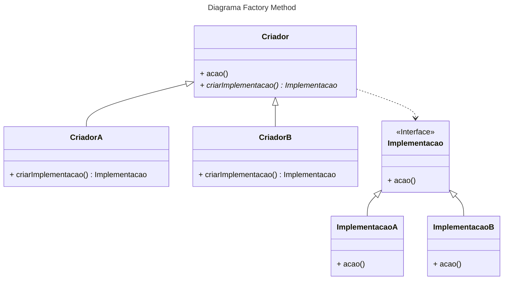

# Factory Method

O `factory method` é um padrão de projetos criacional, ou seja, proporciona a capacidade de criar objetos de formas que aumentam a flexibilidade e permitem a reutilização de código.  
De forma geral a `factory` é uma classe que toma para si a responsabilidade de instanciar objetos de uma determinada `interface`, podendo criar diferentes tipos de instâncias de `classes` que implementam essa `interface`, variando a implementação de acordo com um parâmetro pré-estabelecido.

## Problema prático

Um aplicação de logística está sendo criada, e inicialmente ela só lida com transporte terrestre via caminhões, logo a maior parte do código está na classe **`Caminhão`.**

Quando a aplicação se populariza surgem muitas solicitações de empresas que trabalham com transporte marítimo.

Todavia, a aplicação tem um acoplamento forte com a classe `Caminhão`, o que torna a tarefa de adicionar a classe `Navio`, muito complicada, assim como qualquer outro tipo de transporte que possa vir a aparecer.

## Solução do Problema

Para resolver o problema é criada uma `interface` geral para lidar com os dois tipos de transporte, `Logística`, que possuí duas implementações possíveis, `Terrestre` e `Marítima`. A implementação desejada será definida pelo método criador da factory, de acordo com um parâmetro pré-definido que indica o tipo de transporte desejado. 

Cada meio de transporte lida com um método de `Transporte` diferente, `Barco` e `Caminhão`, então aqui também existe um segundo conjunto de implementações. Mas no contexto geral, tudo é `Logística` e `Transporte`.

## Código da solução
Um [exemplo](factory-method-example.ts) de código aplicando Factory Method.

## Diagrama UML do Padrão

