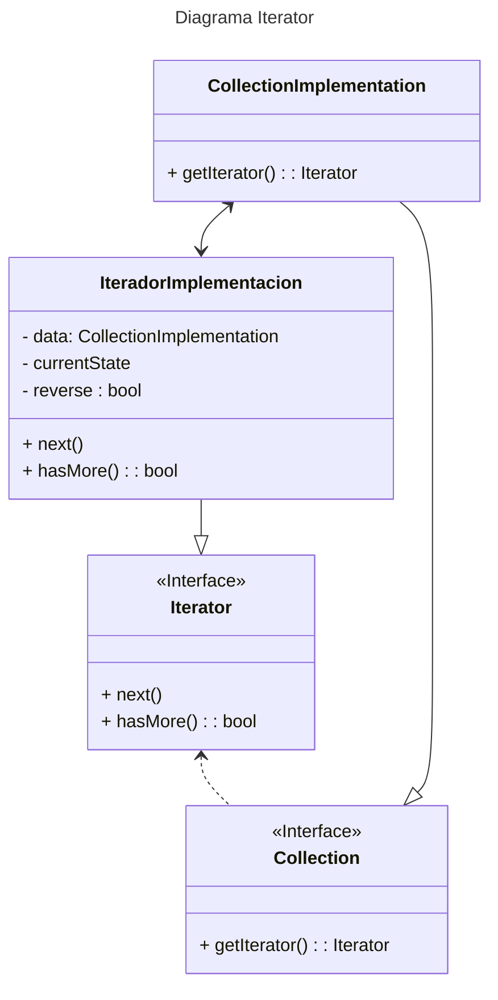

# Iterator

O `Iterator` é um padrão de projeto que permite percorrer coleções de itens de uma forma simples sem expor a implementação interna dela. Ou seja, não importa se por baixo do capô está uma árvore, uma pilha ou uma lista, o comportamento do iterador será o mesmo.  
Esse pattern permite iterar a mesma coleção de forma paralela, já que cada iterador possuí seu próprio estado. Da mesma forma é possível pausar uma iteração quando for necessário.  
Porém, iteradores não são recomendáveis para se trabalhar com padrões simples, e dependendo da coleção é mais eficiente percorrê-las diretamente do que usando um iterador.

## Problema prático

Imagine que se tenha uma estrutura de dados complexa, como uma árvore, e a cada dia é necessário percorrer essa árvore de uma forma diferente. Num dia ela será percorrida tendo como critério base a profundidade, no outro a amplitude e etc.  
Quanto mais caminhos surgirem, mais o foco da estrutura se perde, que é armazenar dados. E para um cliente que utiliza essa árvore, não importa como ela é percorrida. 

## Solução do Problema

O `Iterator` permite extrair os comportamentos das travessias entre os itens da coleção para um objeto separado denominado iterador.
Esse iterador encapsula a lógica responsável por percorrer a coleção, proporcionando uma interface comum.  
Iteradores possuem um método que possibilita obter o próximo elemento da coleção, e quando toda coleção é percorrida nada é retornado, indicando o fim do caminho.  
Voltando ao exemplo da árvore, é como se cada tipo de percurso possuísse uma implementação diferente de um iterador.

## Código da solução

Um [exemplo](iterator.ts) de código aplicando `Iterator`

## Diagrama UML do Padrão

